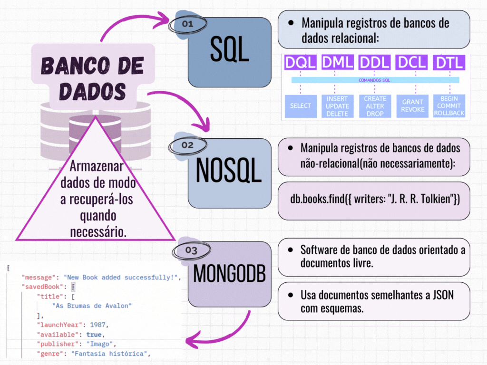

# Exercício de Casa 🏠 

## Banco de Dados

&nbsp;

 **Professora: Gaia Maria**

 **Aluna: Aline de Oliveira Machado** 

&nbsp;

Oie bonitas, vamos lá:
- Entre no arquivo do README, dentro da pasta principal (on22-b3-s12-bd) 
- E responda COM SUAS PALAVRAS o que você entendeu da aula de sabado:
  * pode usar gírias, pajuba, aleatorias, trazer imagens... você escolhe
  * pode ser síntese, textão, mapa conceitual... 
  * me explique principalmente o que você entendeu de Banco de Dados, SQL, NoSQL e de Mongo.
  * caso queira pode me falar tambem onde teve mais dúvidas e qual parte gostariam que eu revisasse na semana 13  .
  obs: se quiser adicione um campo de observação sobre temáticas das últimas semanas (de outras aulas) que você teve mais dificuldade. Vamos revisá-las.

  Na quarta faremos uma atividade oral onde irei fazer perguntas para turma, nem todas precisam participar, mas eu adoraria se vocês participassem. POR FAVOR!

&nbsp;

---

Terminou o exercício? Dá uma olhada nessa checklist e confere se tá tudo certinho, combinado?!

- [x] Fiz o fork do repositório.
- [x] Clonei o fork na minha máquina (`git clone url-do-meu-fork`).
- [x] Resolvi o exercício.
- [x] Adicionei as mudanças. (`git add .` para adicionar todos os arquivos, ou `git add nome_do_arquivo` para adicionar um arquivo específico)
- [x] Commitei a cada mudança significativa ou na finalização do exercício (`git commit -m "Mensagem do commit"`)
- [x] Pushei os commits na minha branch (`git push origin nome-da-branch`)
- [x] Criei um Pull Request seguindo as orientaçoes que estao nesse [documento](/exercicios/para-casa/instrucoes-pull-request.md).